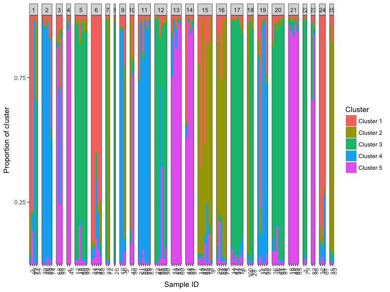
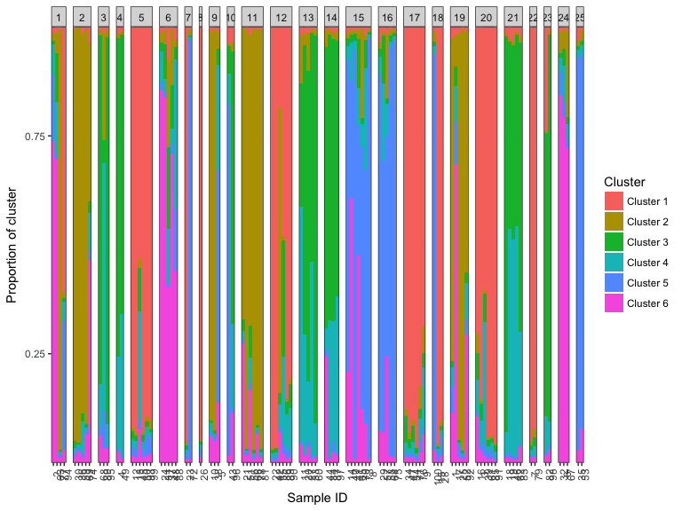
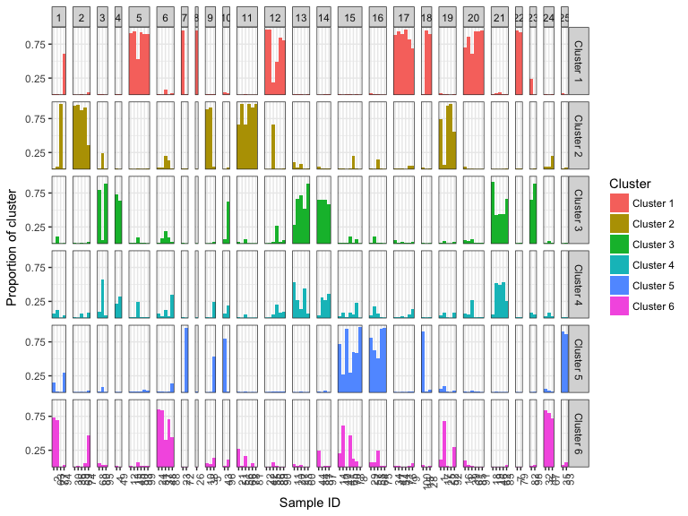
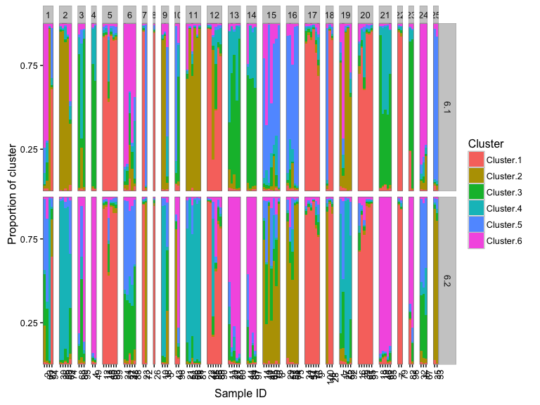
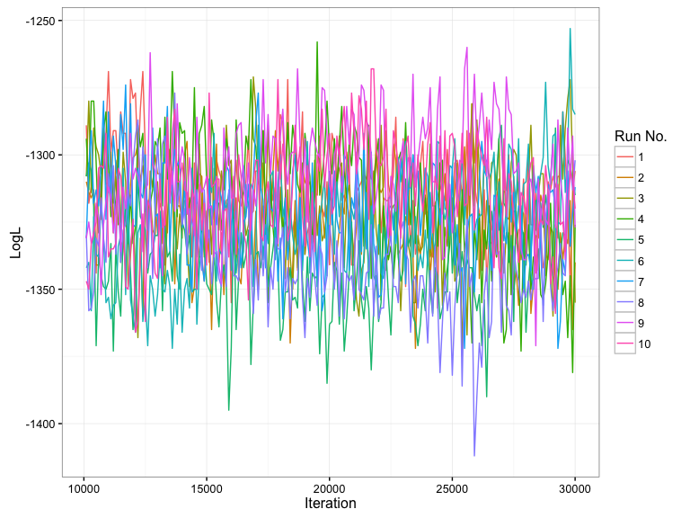
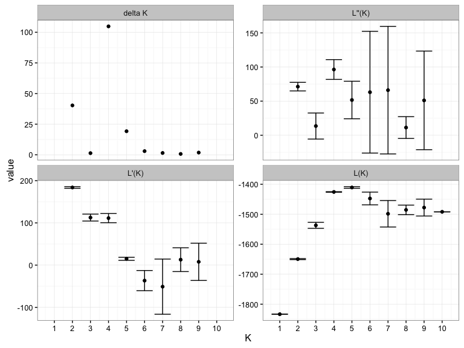
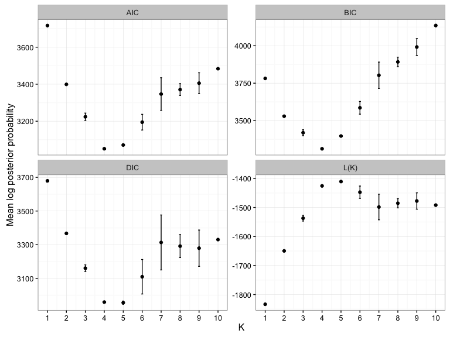
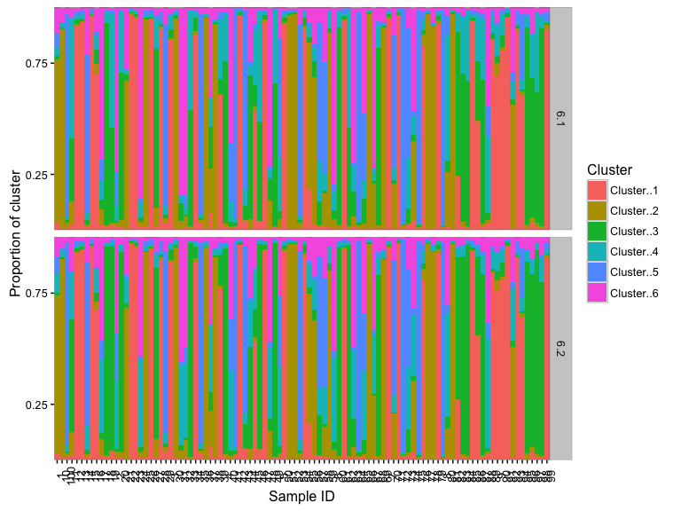
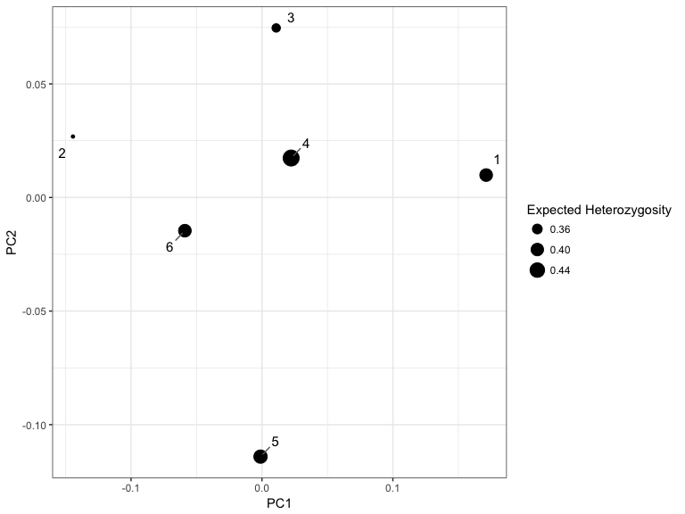

-   [Quick Start](#quick-start)
-   [Installation](#installation)
-   [Starmie: making population structure analyses easier](#starmie-making-population-structure-analyses-easier)
    -   [A basic STRUCTURE pipeline in R.](#a-basic-structure-pipeline-in-r.)
    -   [Parsing STRUCTURE files, the 'struct' object](#parsing-structure-files-the-struct-object)
    -   [Why you're here: the infamous bar plot...](#why-youre-here-the-infamous-bar-plot...)
    -   [Loading multiple 'struct' objects the 'structList'](#loading-multiple-struct-objects-the-structlist)
    -   [Diagnostics: or checking out your chains](#diagnostics-or-checking-out-your-chains)
    -   [Inference on K is hard](#inference-on-k-is-hard)
    -   [CLUMPPING together - avoiding label switching](#clumpping-together---avoiding-label-switching)
    -   [Other visualisations](#other-visualisations)
-   [Bugs, feature requests and miscellana](#bugs-feature-requests-and-miscellana)
-   [References](#references)

<!-- README.md is generated from README.Rmd. Please edit that file -->
[](https://travis-ci.org/sa-lee/starmie)

Quick Start
===========

Construct a barplot for your STRUCTURE/ADMIXTURE output using `starmie` in a few lines of code!

``` r
library(starmie)
str_output <- system.file("extdata/microsat_testfiles/", "locprior_K5.out_f", 
    package = "starmie")
k5_data <- loadStructure(str_output)
k5_data
#> struct object containing run information for k = 5 
#> Model run parameters:
#>   individuals : 100
#>   loci : 10
#>   populations assumed : 5
#>   Burn-in period : 10000
#>   Reps : 20000
#>   turned off : RANDOMIZE
#> Model fit statistics:
#>   Estimated Ln Prob of Data : -1408.8
#>   Mean value of ln likelihood : -1343
#>   Variance of ln likelihood : 131.5
#>   Mean value of alpha : 0.0452
#> MCMC diagnostics available: FALSE
plotBar(k5_data)
#> Extracting population labels from STRUCTURE output.
```



Installation
============

Currently `starmie` can be installed using the devtools package

``` r
install.packages("devtools")
library(devtools)
install_github("sa-lee/starmie")
```

If you would like to also build the vignette with your installation run:

``` r
install_github("sa-lee/starmie", build_vignettes = TRUE)
```

Starmie: making population structure analyses easier
====================================================

A very common part of modern population genetics analysis is inferring underlying population structure from genetic markers such as single nucleotide polymorphisms (SNPs) or microsatellites. The two main methods for this task are the Bayesian STRUCTURE algorithm or the frequentist ADMIXTURE. We have found that processing the output of these programs and performing meaningful inference and visualization of the results is far more difficult than it should be. This is why we wrote starmie.

Some key features:

-   Parse output from STRUCTURE or ADMXITURE into a usable data structure in R.
-   Plot model diagnostics to perform inference on choice of 'K'.
-   Create the 'standard' STRUCTURE bar plot showing cluster memberships.
-   Plot model checks such as MCMC chains on the admixture coefficient \(\alpha\) and the log-likelihood.
-   Visualizing output from STRUCTURE analysis

This vignette outlines how to use starmie to do basic tasks after running STRUCTURE at the command line.

A basic STRUCTURE pipeline in R.
--------------------------------

To use all the options in starmie for STRUCTURE output, we require for each run the 'out\_f' file produced by the program and the logging information so we can produce MCMC diagnostics. To get the latter the output of STRUCTURE must be redirected to a file. Below we present an example of running STRUCTURE in multiple runs for each K in parallel. We assume that the `mainparams` and `extraparams` files are correctly specified and that the user has access to the path of the STRUCTURE binary. Also make sure RANDOMIZE option is turned off, so independent seeds can be set in each run.

``` r
input_file <- system.file("inst/extdata/microsat_testfiles", "locprior.str", 
    package = "starmie")
main_params <- system.file("inst/extdata/microsat_testfiles", "mainparams", 
    package = "starmie")
extra_params <- system.file("inst/extdata/microsat_testfiles", "extraparams", 
    package = "starmie")
runStructure("path/to/structure", input_file, main_params, extra_params, "run", 
    5, 2, 2)
```

Parsing STRUCTURE files, the 'struct' object
--------------------------------------------

The basic unit of analysis for `starmie` is the `struct` object, which contains the model information in the STRUCTURE out\_f file and optionally the logging information for the MCMC diagnostics. As an example, we have run STRUCTURE on [simulated microsatellite data](http://pritchardlab.stanford.edu/software/example-data/locprior.str) from the STRUCTURE example data and save the out\_f. To create a `struct` object from a run we use the following:

``` r
library(starmie)
# path to file name
k6_file <- system.file("extdata/microsat_testfiles/", "locprior_K6.out_f", package = "starmie")
# create struct object
k6_msat <- loadStructure(k6_file)

k6_msat
#> struct object containing run information for k = 6 
#> Model run parameters:
#>   individuals : 100
#>   loci : 10
#>   populations assumed : 6
#>   Burn-in period : 10000
#>   Reps : 20000
#>   turned off : RANDOMIZE
#> Model fit statistics:
#>   Estimated Ln Prob of Data : -1462.4
#>   Mean value of ln likelihood : -1333.7
#>   Variance of ln likelihood : 257.4
#>   Mean value of alpha : 0.0455
#> MCMC diagnostics available: FALSE
```

The STRUCTURE object contains the following information about a single run:

| attributes          | description                                               |
|:--------------------|:----------------------------------------------------------|
| K                   | K parameter supplied to STRUCTURE                         |
| run\_params         | Input parameters                                          |
| mem\_df             | Assigned cluster membership proportions                   |
| allele\_freqs       | Pairwise Fst values between inferred clusters             |
| avg\_dist\_df       | Average nucleotide distance within clusters               |
| fst\_df             | Within cluster average Fst values                         |
| fit\_stats\_df      | Model fit diagnositcs                                     |
| ancest\_df          | Individual ancestral probability of membership to cluster |
| clust\_allele\_list | Estimated ancestral allele frequencies for each cluster   |
| burn\_df            | MCMC burn-in diagnositcs                                  |
| nonburn\_df         | MCMC post burn-in diagnostics                             |

Of most interest to users would be the `ancest_df` which is the Q-matrix of individual cluster membership probabilities. To extract that information for inspection use the helper function `getQ`.

``` r
Q_hat <- getQ(k6_msat)
```

Why you're here: the infamous bar plot...
-----------------------------------------

To make the bar-plot simply type:

``` r
plotBar(k6_msat, facet = FALSE)
#> Extracting population labels from STRUCTURE output.
```



This will group the known sample labels into population labels if they were supplied to the STRUCTURE run. Alternatively, you can facet the inferred cluster labels to make it easier to see outliers and geographical groupings.

``` r
plotBar(k6_msat)
#> Extracting population labels from STRUCTURE output.
```



If you have not given population labels to your samples you can also add them using the `populations` argument.

Loading multiple 'struct' objects the 'structList'
--------------------------------------------------

The `structList` is a container for manipulating multiple `struct` objects. Some potential use-cases are:

-   load multiple \(K\) values from different runs and perform model comparisons.
-   pool a sequence of runs over the same value of \(K\) and perform CLUMPPing

On our example microsatellite data to add the second run for the results of running STRUCTURE \(K\) = 6 ,we first load the output file, and then pass both `struct` objects to the `structList` function.

``` r
k6_file_run2 <- system.file("extdata/microsat_testfiles/", "run2_locprior_K6.out_f", 
    package = "starmie")

k6_run2 <- loadStructure(k6_file_run2)

k6_all <- structList(k6_msat, k6_run2)

k6_all
#> structList object containing 2  STRUCTURE runs.
#> Number of Ks by number of runs:
#> 6 
#> 2
```

We can also compare the cluster labeling by using `plotMultiK` (and see that label-switching over different MCMC runs is a problem!)

``` r
plotMultiK(k6_all)
#> Extracting population labels from STRUCTURE output.
```



Diagnostics: or checking out your chains
----------------------------------------

A very simple approach to determining whether you need to rerun a STRUCTURE a model is to plot the estimated log-likelihood over each iteration over the post burn-in MCMC phase. If the chains have converged the log-likelihood should stabilize towards the final iterations and the variance within a run should be relatively low. The `plotMCMC` can plot the log-likelihood or admixture coefficient against the iteration over different runs and different \(K\) values. Note this requires the logging file to be read by `loadStructure`.

Here we show an example when \(K\) = 10 and the number of runs is also 10.

``` r
multiple_runs_k10 <- exampleStructure("mcmc_diagnostics")

mcmc_out <- plotMCMC(multiple_runs_k10, facet = FALSE)
```



``` r

head(mcmc_out$mcmc_info)
#>     K Iteration Alpha  LogL run
#> 1: 10     10100 0.034 -1289   1
#> 2: 10     10200 0.038 -1318   1
#> 3: 10     10300 0.039 -1312   1
#> 4: 10     10400 0.040 -1314   1
#> 5: 10     10500 0.042 -1344   1
#> 6: 10     10600 0.042 -1305   1
```

Inference on K is hard
----------------------

Usually you would run STRUCTURE multiple times for multiple values of \(K\) and then use estimates of the log-likelihood to determine the 'best' choice of \(K\) that explains the population structure in your data. There are two choices for model selection - either use the maximum mean log-posterior probability estimated by STRUCTURE or use the Evanno method. The `bestK` function returns the value of \(K\) that is estimated by these methods and also produces diagnostic plots.

``` r
multi_K <- exampleStructure("multiple_runs")
bestK(multi_K)
#> Creating diagnostic plots for structure runs.
```



    #>     K variable         value         sd
    #> 1   1     L(K) -1833.4000000  0.1414214
    #> 2   1    L'(K)            NA         NA
    #> 3   1   L''(K)            NA         NA
    #> 4   1  delta K            NA         NA
    #> 5   2     L(K) -1649.5500000  1.7677670
    #> 6   2    L'(K)   183.8500000  1.9091883
    #> 7   2   L''(K)    71.2500000  6.2932504
    #> 8   2  delta K    40.3050865         NA
    #> 9   3     L(K) -1536.9500000  9.9702056
    #> 10  3    L'(K)   112.6000000  8.2024387
    #> 11  3   L''(K)    13.5000000 19.0918831
    #> 12  3  delta K     1.3540343         NA
    #> 13  4     L(K) -1425.6500000  0.9192388
    #> 14  4    L'(K)   111.3000000 10.8894444
    #> 15  4   L''(K)    96.3500000 14.4956890
    #> 16  4  delta K   104.8149821         NA
    #> 17  5     L(K) -1410.7000000  2.6870058
    #> 18  5    L'(K)    14.9500000  3.6062446
    #> 19  5   L''(K)    51.6500000 27.5064538
    #> 20  5  delta K    19.2221396         NA
    #> 21  6     L(K) -1447.4000000 21.2132034
    #> 22  6    L'(K)   -36.7000000 23.9002092
    #> 23  6   L''(K)    63.1000000 89.2368758
    #> 24  6  delta K     2.9745625         NA
    #> 25  7     L(K) -1498.4000000 44.1234631
    #> 26  7    L'(K)   -51.0000000 65.3366666
    #> 27  7   L''(K)    66.1000000 93.4795165
    #> 28  7  delta K     1.4980692         NA
    #> 29  8     L(K) -1485.5000000 15.9806133
    #> 30  8    L'(K)    12.9000000 28.1428499
    #> 31  8   L''(K)    11.3000000 15.9806133
    #> 32  8  delta K     0.7071068         NA
    #> 33  9     L(K) -1477.7000000 28.1428499
    #> 34  9    L'(K)     7.8000000 44.1234631
    #> 35  9   L''(K)    51.1000000 72.2663130
    #> 36  9  delta K     1.8157365         NA
    #> 37 10     L(K) -1491.9000000  0.0000000
    #> 38 10    L'(K)            NA         NA
    #> 39 10   L''(K)            NA         NA
    #> 40 10  delta K            NA         NA
    bestK(multi_K, "structure")
    #> Creating diagnostic plots for structure runs.



    #>       K variable     value          sd
    #> 1.1   1     L(K) -1833.400   0.1414214
    #> 1.2   1      AIC  3662.800   0.2828427
    #> 1.3   1      BIC  3657.590   0.2828427
    #> 1.4   1      DIC  3679.300   0.4242641
    #> 2.1   2     L(K) -1649.550   1.7677670
    #> 2.2   2      AIC  3291.100   3.5355339
    #> 2.3   2      BIC  3280.679   3.5355339
    #> 2.4   2      DIC  3367.300   5.7982756
    #> 3.1   3     L(K) -1536.950   9.9702056
    #> 3.2   3      AIC  3061.900  19.9404112
    #> 3.3   3      BIC  3046.269  19.9404112
    #> 3.4   3      DIC  3160.600  19.7989899
    #> 4.1   4     L(K) -1425.650   0.9192388
    #> 4.2   4      AIC  2835.300   1.8384776
    #> 4.3   4      BIC  2814.459   1.8384776
    #> 4.4   4      DIC  2959.200   3.9597980
    #> 5.1   5     L(K) -1410.700   2.6870058
    #> 5.2   5      AIC  2801.400   5.3740115
    #> 5.3   5      BIC  2775.348   5.3740115
    #> 5.4   5      DIC  2955.900   9.7580736
    #> 6.1   6     L(K) -1447.400  21.2132034
    #> 6.2   6      AIC  2870.800  42.4264069
    #> 6.3   6      BIC  2839.538  42.4264069
    #> 6.4   6      DIC  3109.800 102.3890619
    #> 7.1   7     L(K) -1498.400  44.1234631
    #> 7.2   7      AIC  2968.800  88.2469263
    #> 7.3   7      BIC  2932.328  88.2469263
    #> 7.4   7      DIC  3313.400 163.2002451
    #> 8.1   8     L(K) -1485.500  15.9806133
    #> 8.2   8      AIC  2939.000  31.9612265
    #> 8.3   8      BIC  2897.317  31.9612265
    #> 8.4   8      DIC  3291.700  68.3065151
    #> 9.1   9     L(K) -1477.700  28.1428499
    #> 9.2   9      AIC  2919.400  56.2856998
    #> 9.3   9      BIC  2872.507  56.2856998
    #> 9.4   9      DIC  3279.400 107.7630735
    #> 10.1 10     L(K) -1491.900   0.0000000
    #> 10.2 10      AIC  2943.800   0.0000000
    #> 10.3 10      BIC  2891.697   0.0000000
    #> 10.4 10      DIC  3330.400   5.3740115

CLUMPPING together - avoiding label switching
---------------------------------------------

We have written R implementations of the popular CLUMMP and CLUMPAK algorithms for combining Q-matrices over different runs of STRUCTURE. Usually, this step is performed after choosing a value for \(K\), when the analyst would like to refine their estimates of cluster memberships. To perform CLUMPPING create a `structList` consisting of the same value of \(K\) for multiple runs. In each case the Q-matrices and a matrix of column permutations for each run are returned.

We return to the example of our two runs of \(K\) = 6, stored in `k6_all` defined above.

``` r
Q_list <- lapply(k6_all, getQ)
clumpak_results <- clumpak(Q_list)

clumppy <- clumpp(Q_list, method = "greedy")

# plot the results
plotMultiK(clumppy$Q_list)
```



Several other algorithms to correct label switching are available, including fast implementations for large values of K.

Other visualisations
--------------------

As the STRUCTURE model outputs other information, we have implemented some multidimensional scaling plots to visualize some of the neglected features of the STRUCTURE model.

For example, we can plot the net nucleotide distance between clusters:

``` r
plotMDS(k6_msat)
```



Bugs, feature requests and miscellana
=====================================

Please submit any bugs or features requests as an issue to <https://github.com/sa-lee/starmie/issues> Pull requests are completely welcome.

References
==========

Kopelman, N. M., Mayzel, J., Jakobsson, M., Rosenberg, N. A. & Mayrose, I. Clumpak: a program for identifying clustering modes and packaging population structure inferences across K. Mol. Ecol. Resour. 15, 1179–1191 (2015).

Stephens, M. Dealing with label switching in mixture models. J. R. Stat. Soc. Series B Stat. Methodol. 62, 795–809 (2000).

Jakobsson, M. & Rosenberg, N. A. CLUMPP: a cluster matching and permutation program for dealing with label switching and multimodality in analysis of population structure. Bioinformatics 23, 1801–1806 (2007).

Hubisz, M. J., Falush, D., Stephens, M. & Pritchard, J. K. Inferring weak population structure with the assistance of sample group information. Mol. Ecol. Resour. 9, 1322–1332 (2009).

Falush, D., Stephens, M. & Pritchard, J. K. Inference of population structure using multilocus genotype data: dominant markers and null alleles. Mol. Ecol. Notes 7, 574–578 (2007).

Falush, D., Stephens, M. & Pritchard, J. K. Inference of population structure using multilocus genotype data: linked loci and correlated allele frequencies. Genetics 164, 1567–1587 (2003).

Pritchard, J. K., Stephens, M. & Donnelly, P. Inference of population structure using multilocus genotype data. Genetics 155, 945–959 (2000).

Verity, R. & Nichols, R. A. Estimating the Number of Subpopulations (K) in Structured Populations. Genetics (2016).
